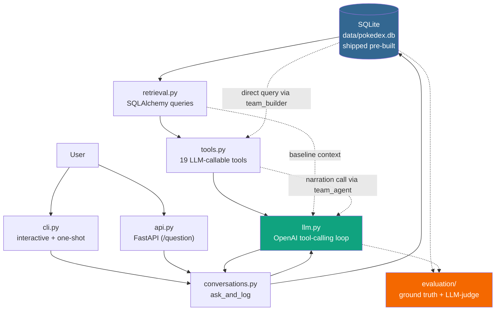

## Professor Oak AI: Pokémon Battle & Lore Assistant
### Problem Statement

When playing Pokémon or researching the games, getting accurate information is surprisingly tricky because the data is split into two completely different types:

* **Strict Numeric Stats**: Things like type effectiveness, base stats, and move sets where precision is key.

* **Open-ended Lore**: Background stories, legendary myths, and Pokédex descriptions spread across different game versions.

General-purpose LLMs usually struggle here. They frequently hallucinate stats, mix up mechanics between different game generations, or confuse move pools. On the flip side, manually digging through wikis and spreadsheets to prepare a single battle strategy takes too much time.

#### Project Goal & Solution

Professor Oak AI is a domain-specific RAG (Retrieval-Augmented Generation) assistant designed to act as an expert guide for Pokémon trainers.

Instead of relying solely on the LLM's pre-trained memory, this system grounds its answers in a curated dataset combining structured game mechanics and Pokédex entries.

#### Key Features

* **Battle & Tactical Advice**: Offers team-building suggestions and type match-up strategies using verified stat data.

* **Canonical Pokédex Lore**: Surfaces official in-game descriptions for a named Pokémon, straight from canonical Pokédex entries.

* **Structured Retrieval**: Uses keyword/name matching against a curated SQL database to keep answers grounded and hallucination-free.

## Architecture



Every question first gets a baseline context block injected automatically (`retrieve_context`, a keyword/name match against the question text — no LLM call needed for this step), then goes through an OpenAI tool-calling loop that can call any of 19 tools to fetch more specific data before answering. Most tools go through `retrieval.py`, but the team-building tool (`build_team`) is its own self-contained pipeline: `team_builder.py` queries the database directly (not through `retrieval.py`) and `team_agent.py` deterministically assembles a full roster, making its own separate OpenAI call at the very end just to narrate the already-decided result in prose — a second, independent LLM call site nested inside the outer tool-calling loop, not a call back into it. `cli.py` and `api.py` are both thin callers around the same `conversations.ask_and_log()` orchestration, so every conversation gets persisted identically to the same SQLite database the agent reads from, regardless of which interface was used.

## Quickstart

```bash
uv sync
echo "OPENAI_API_KEY=sk-..." >> .env

# data/pokedex.db ships pre-built and fully ingested -- this just applies any
# migrations newer than the shipped snapshot (usually a no-op)
uv run alembic upgrade head

uv run profesor-oak-ai
```

Or start the HTTP API instead of the CLI:
```bash
uv run profesor-oak-ai-api
# or, for auto-reload during development:
uv run uvicorn profesor_oak_ai.agent.api:app --reload

curl -X POST localhost:8000/question \
  -H 'content-type: application/json' \
  -d '{"question": "What are Bulbasaur'"'"'s types and base stats?"}'
```
Interactive Swagger docs are served at `localhost:8000/docs`.

### Or run everything in Docker

```bash
echo "OPENAI_API_KEY=sk-..." >> .env
docker compose up --build
```
The container's `entrypoint.sh` just applies migrations against the shipped `data/pokedex.db` before starting the API on `localhost:8000`. `data/` is bind-mounted from the host, so conversation history persists across container restarts and the database can be inspected from outside Docker too.

Run the CLI through the same image instead:
```bash
docker compose run --rm -it app profesor-oak-ai            # interactive
docker compose run --rm app profesor-oak-ai "What are Bulbasaur's types and base stats?"  # one-shot
```

### Prerequisites

- Python 3.13
- [uv](https://docs.astral.sh/uv/) for dependency management
- An OpenAI API key

`data/pokedex.db` is committed to this repo, already fully ingested — there's no ingestion pipeline in this repo to rebuild it from scratch. `alembic upgrade head` only needs to run to pick up any schema migrations added after the snapshot was taken.

## Testing

There is no automated test suite (see [Limitations](#limitations)) — the CLI is the primary way to exercise the application, alongside the evaluation harness below.

Interactive mode:
```bash
uv run profesor-oak-ai
```

One-shot mode (answers a single question and exits, script-friendly):
```bash
uv run profesor-oak-ai "What are Bulbasaur's types and base stats?"
```

Example:
```
> How effective is a Water-type move against a Fire/Rock Pokémon?
Water is 4x effective against a Fire/Rock-type Pokémon...
```

Every conversation, in both interactive and one-shot mode, is also run through the same LLM-as-judge relevance check used by the evaluation harness below, and has its token usage and USD cost tracked (`relevance`, token counts, `cost`, etc. on the `conversations` table) — not just conversations logged during an eval run. The same is true of the HTTP API's `POST /question`, since both interfaces call the same `conversations.ask_and_log()`.

### HTTP API

```bash
uv run profesor-oak-ai-api
```

- `POST /question` — body `{"question": "...", "thread_id": "..."}` (`thread_id` optional, omit to start a new conversation thread), returns `{"conversation_id": "...", "thread_id": "...", "answer": "..."}`.
- `GET /health` — liveness check.
- `GET /dashboard` — a small monitoring page (conversation/cost totals, relevance breakdown, daily activity, recent conversations), reading directly from the `conversations` table. See [Monitoring](#monitoring) below.

## Evaluation

### Retrieval and RAG evaluation

This project's retrieval isn't a single ranked-index lookup (like a vector or TF-IDF search) — the agent *chooses which of 19 tools to call* via OpenAI tool-calling, on top of an automatically-injected baseline context. So the two metrics are adapted accordingly:

- **Retrieval accuracy**: for a ground-truth question with a known expected tool, was that tool actually invoked?
- **RAG evaluation**: an LLM-as-judge call classifies the final answer as `RELEVANT`, `PARTLY_RELEVANT`, or `NON_RELEVANT`.

Ground truth: 18 hand-written questions in [`evaluation/ground_truth.jsonl`](evaluation/ground_truth.jsonl). Run the harness with:
```bash
uv run python -m profesor_oak_ai.evaluation.run_eval
```

[`evaluation/results.csv`](evaluation/results.csv) holds the latest run's output. Relevance is judged by a fresh LLM call each run, so exact numbers shift slightly between runs of the same model.

### Model comparison

The harness also supports comparing models via the `OPENAI_MODEL` env var, so "the best one is used" is an actual measured choice, not just the untested default:

| Model | Retrieval accuracy | RELEVANT | PARTLY_RELEVANT | NON_RELEVANT |
|---|---|---|---|---|
| **gpt-5.4-mini** (chosen default) | 16/16 (100%) | 61-67% | 33% | 0-6% |
| gpt-5.4 (full) | 16/16 (100%) | 44% | 44% | 11% |

```bash
OPENAI_MODEL=gpt-5.4 uv run python -m profesor_oak_ai.evaluation.run_eval
```

Both models tie on retrieval accuracy, but gpt-5.4-mini gives a meaningfully better relevance split — and it's the cheaper tier. This comparison is what surfaced a real bug: `retrieval.list_pokemon_by_color` computed its result but never returned it (falling off the end of the function, implicitly returning `None`), silently breaking every "which Pokémon are `<color>`" question regardless of model. Fixed; both models' numbers above are post-fix. The remaining `NON_RELEVANT` cases in both are a known, deliberate trade-off, not this bug: `get_type_effectiveness` is intentionally excluded from counting as "grounded" (to stop the model treating a fictional creature's made-up type as confirmed real), so a bare type-vs-type question with no named creature can never be marked grounded and its correct answer gets overridden by the "insufficient information" fallback every time.

## Monitoring

```bash
uv run profesor-oak-ai-api
# then open http://localhost:8000/dashboard
```

A small server-rendered dashboard, reading live from the same `conversations` table every CLI and API call writes to (`agent/dashboard.py`, no separate ETL or export step):

- Summary cards: total conversations, total cost (USD), average tokens/conversation
- Relevance breakdown (`RELEVANT`/`PARTLY_RELEVANT`/`NON_RELEVANT`/`UNKNOWN`, plus "Not judged" for conversations logged before relevance tracking existed)
- Grounding breakdown: how each answer's subject got confirmed real — `context` (the automatic baseline retrieval), `tool` (a name-resolving tool call), or `none` (never grounded, worth checking for hallucinated subjects that slipped past rule 3), plus "Not tracked" for conversations logged before grounding tracking existed
- Daily activity: conversations and cost per day, last 14 days
- Recent conversations table, with relevance, grounding source, and cost per row

No new service or dependency — it's one FastAPI route rendering plain HTML with inline CSS (see [Decisions and trade-offs](#decisions-and-trade-offs) for why this was chosen over Grafana).

## Decisions and trade-offs

- **Shipped, pre-built database over an in-repo ingestion pipeline**: `data/pokedex.db` is committed directly rather than reproducible from tracked ingestion scripts. A full fetch-from-PokeAPI-and-populate pipeline existed earlier and produced this database, but ran into real-world friction (a fresh clone's setup time dominated by rate-limited network calls to PokeAPI) that outweighed the benefit of reproducibility for a dataset that only needs to be built once. The trade-off: no way to rebuild from scratch or extend to more species from this repo alone (see [Limitations](#limitations)).
- **SQL/keyword retrieval over vector embeddings**: this project used Qdrant + Ollama embeddings for semantic lore search earlier on, then removed it. The dataset is fully structured (a relational Pokédex, not free-text documents), so exact/fuzzy name and keyword matching against SQL columns covers the real query patterns without the operational overhead of an embedding store.
- **SQLite over Postgres**: conversation logging reuses the same SQLite database the app already ships with, rather than adding a second database engine — nothing else in this project needs Postgres's concurrency/networking features.
- **Gen 1-only in scope**: the database (and every design decision behind it — which evolution-condition fields to model, which Pokédexes to store numbers for, which type-chart generation to treat as historical) was built and verified against Gen 1 specifically, not built to be trivially re-scoped to later generations.
- **Movesets are scoped to Red/Blue/Yellow, not every game a move has ever appeared in**: PokeAPI's per-species movepool spans every generation through the present, so only a `version_group_details` entry whose game version is Gen 1 (`red-blue`/`yellow`) was kept -- e.g. Charizard's level-up moves are exactly its real Gen-1 set (Ember/Growl/Leer/Scratch at 1, Rage at 24, Slash at 36, Flamethrower at 46, Fire Spin at 55), not padded with moves it only learned via a later TM, egg move, or tutor (neither of the latter two existed yet). A handful of species genuinely learn a move at a different level in Yellow than in Red/Blue (Yellow retuned some movesets to match the anime); both values are kept as separate rows rather than picking one arbitrarily.
- **`ask()`/`run_conversation()` kept persistence- and evaluation-agnostic**: the core question-answering functions have no knowledge of conversation logging or evaluation. Persistence, judging, and cost tracking live in `conversations.ask_and_log()`, one shared orchestration function that both `cli.py` and `api.py` call — this is what let the HTTP API get added as a thin new caller instead of a rewrite.
- **FastAPI over Flask for the HTTP API**: the fitness-assistant reference project uses Flask, but this project picked FastAPI instead for built-in request validation (Pydantic) and automatic OpenAPI/Swagger docs (`/docs`), at the cost of diverging from the example's stack.
- **Bind-mounted `data/` over a named Docker volume**: this is a single-container, single-machine SQLite setup, not a multi-host deployment, so there's no benefit to hiding the database inside Docker-managed storage. Bind-mounting lets conversation history persist across container restarts and lets the database be inspected from outside Docker too.
- **Built-in HTML dashboard over Grafana**: the fitness-assistant reference project uses Grafana against Postgres. This project's data lives in SQLite, and Grafana's SQLite support is an unsigned community plugin rather than a first-class data source — adding it (plus a new docker-compose service) for a handful of read-only aggregate queries was more infra than the payoff justified. A single FastAPI route querying the existing tables directly avoids that fragility, at the cost of a less polished/interactive UI than Grafana would give. Note that per-tool usage (which of the 19 tools got called) isn't a metric this dashboard can show, since that's never persisted per conversation — only the final answer, relevance, and token/cost counts are.

## Limitations

- **No automated test suite** — verification throughout development has been direct functional testing (running the CLI, querying the database, and the evaluation harness above) rather than a `pytest` suite.
- **No web UI** — the CLI and the HTTP API (`api.py`) are the only interfaces; no frontend.
- **No per-tool usage tracking** — `GET /dashboard` can't show "most-used tool" or similar, because which of the 19 tools got called per conversation is never persisted (only used transiently during the request); would need a schema change to track.
- **LLM-as-judge evaluation is itself fallible** — see the Evaluation section above; at least one `PARTLY_RELEVANT` result across evaluation runs has been the judge being factually wrong, not the system under test.
- **No localization** — only English text is stored anywhere in the schema, even though the original PokeAPI data has many languages.
- **Team-building is grounded in a single, frozen usage snapshot** — `build_team` reasons from one Smogon Gen1-OU usage-stats snapshot baked into the shipped database at build time (62 of 151 species covered), not a live or continuously-updated source; its real-usage pool and pervasiveness numbers only reflect that snapshot.
- **No ingestion pipeline in this repo** — `data/pokedex.db` is shipped pre-built; there's no tracked way to rebuild it from scratch, extend it to more species, or refresh it against a newer PokeAPI/Smogon snapshot without recreating that pipeline.
